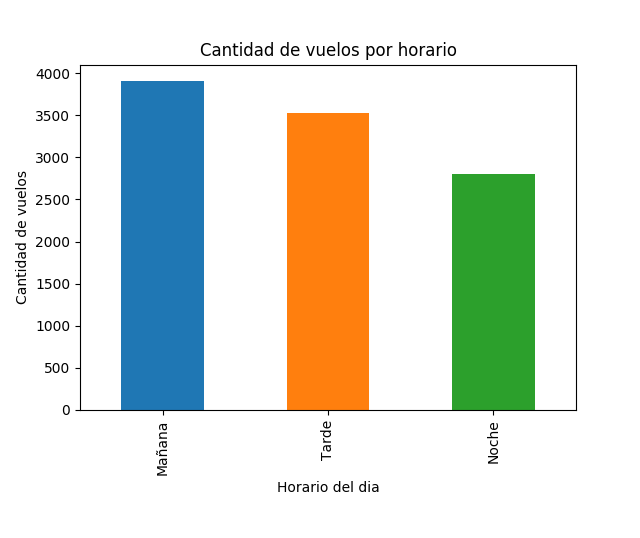
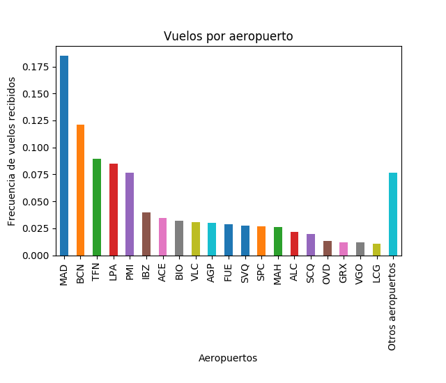
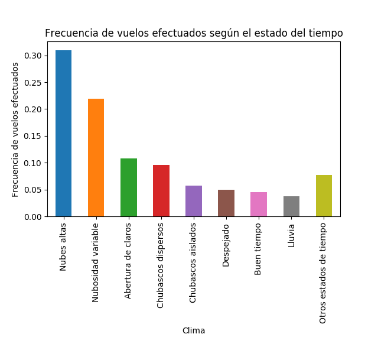
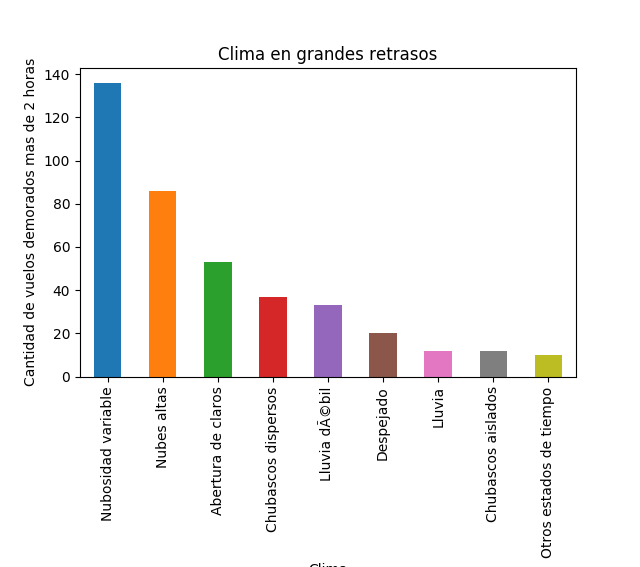
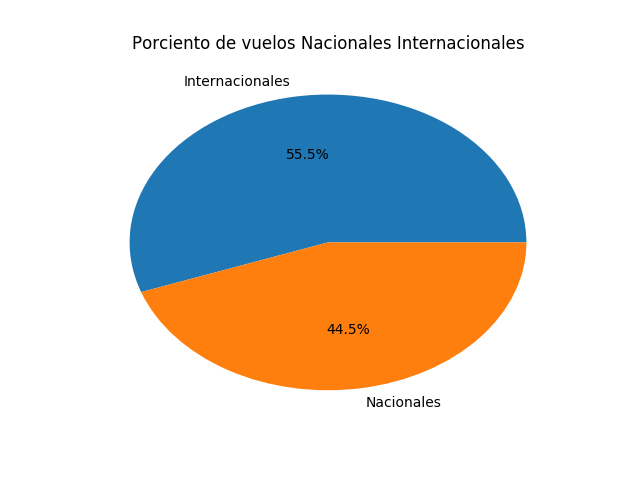
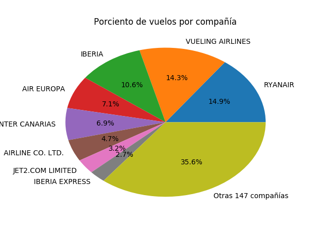

#AENA Info Vuelos V2

## 1. Descripción del dataset.

El *dataset* elegido para esta práctica es el generado como resultado de la primera práctica de la asignatura, que denominamos **AENA Infovuelos**, y se encuentra disponible para su descarga desde el repositorio de GitHub, en la dirección siguiente: [https://github.com/InnocenceAllen/AENA_Info_Vuelos/blob/master/infovuelos_sample.csv](https://github.com/InnocenceAllen/AENA_Info_Vuelos/blob/master/infovuelos_sample.csv) 

Dicho dataset contiene los detalles de todos los vuelos con salida o llegada en un aeropuerto en territorio español, registrados desde el día 13/4/2018 a las 10:30h, hasta el 15/4/2018 a las 19:00h. La información contenida en el dataset se ha obtenido mediante la aplicación de técnicas de webscrapping sobre [Infovuelos](http://www.aena.es/csee/Satellite/infovuelos/es/) Infovuelos, la Web de información de AENA, la empresa responsable de la gestión de los aeropuertos españoles. Para no perder vuelos y obtener información lo más actualizada posible, se repitió el scrapping con una frecuencia de muestreo de una hora, es decir, cada hora se obtuvieron los datos de los vuelos anunciados en la Web de AENA en primera página.

La siguiente imagen muestra una captura de pantalla extraída de la Web Infovuelos con la información de un vuelo en particular, lo que nos da idea del tipo de datos que vamos a capturar.


Como podemos ver, se incluyen los siguientes datos:
- Número de vuelo
- Origen y destino
- Modelo de avión
- Climatología en origen y destino del vuelo
- Fecha y hora de salida y de llegada, así como estado del vuelo (informa sobre el horario previsto, o el horario real en caso de haberse producido ya el despegue o aterrizaje)
- Terminal de salida, mostrador de facturación, puerta de embarque
- Terminal y sala de llegada, y cinta de recogida de equipajes

En apartados posteriores haremos un análisis más detallado de los datos, incluyendo su tipo y problemática encontrada durante su tratamiento.

### ¿Por qué es importante y qué pregunta/problema pretende responder?
  
Obviamente, si lo que buscamos es información actualizada, sobre un vuelo específico, podemos utilizar la Web de AENA para obtener dicha información actualizada. Este sería el caso de uso habitual de un viajero que está a punto de embarcar en un avión.

Sin embargo, la recopilación sistemática de registros de vuelos, con un análisis adecuado, nos va a permitir responder a una serie de preguntas interesantes sobre el tráfico aéreo en España, sobre un aeropuerto en particular, sobre una compañía, o incluso sobre un modelo de avión en particular.  Uno de los datos que nos parece más interesante conocer es el relativo a los retrasos acaecidos. Si bien esta información no se incluye directamente en los datos proporcionados, sí que lo podremos obtener comparando horario programado con el horario real, obtenido a partir del estado del vuelo una vez efectuado el despegue o aterrizaje.

Una vez tratados los datos, podríamos realizar diferentes tipos de análisis:

- Análisis estadísticos relacionados con el volumen de tráfico aéreo, tanto a nivel geográfico como temporal. Es decir, se podría analizar la información agrupándola por poblaciones o regiones, y por periodos de tiempo de distinta granularidad, como días, semanas, meses o años. así mismo se podría distinguir entre vuelos nacionales e internacionales, y analizar la relación entre algunos de estos atributos. Por ejemplo, podríamos analizar la relación entre tráfico aéreo y periodos vacacionales, o descubrir cuales son los destinos turísticos preferidos de los extranjeros que visitan nuestro país, así como su origen. En principio, sólo contamos con información relativa al número de vuelos, pero si consideramos el modelo de avión, podríamos llegar a estimar el volumen de pasajeros, ya que cada modelo de avión tiene un número de plazas conocido.
- Análisis de retrasos. Comparando horarios teóricos con los horarios reales de llegada y salida de los vuelos, sería posible cuantificar los retrasos acaecidos, un dato muy interesante que nos permitiría evaluar el nivel de retraso por aeropuerto o por aerolínea. Podríamos analizar este retraso para determinar los principales factores que influyen en él. Por ejemplo, podríamos investigar si influye el volumen de tráfico, la nacionalidad del vuelo o el clima.
- Descripción de los aeropuertos: analizando la información en detalle podríamos averiguar la estructuración de cada aeropuerto: número de terminales, número de salas, mostradores de facturación, etc.
- En un segundo nivel de análisis, la aplicación de técnicas de minería de datos nos permitiría crear modelos predictivos para estimar por ejemplo, la probabilidad de que un vuelo se retrase en el futuro.

A continuación se proporciona una muestra del tipo de preguntas que podríamos responder tras un análisis adecuado de los datos incluidos en este dataset.

- ¿Cuáles son los aeropuertos con más tráfico aéreo de España por número de vuelos?¿y por tránsito de pasajeros (estimado)? 
- ¿Y cuáles son los aeropuertos con más tráfico distinguiendo entre vuelos nacionales e internacionales nacional?
- ¿Cuáles son las franjas horarios con más tráfico aéreo?
- ¿Cuáles son las compañias aéreas con más actividad en España?
- ¿Qué factores influyen en la probabilidad de sufrir un retraso?
- ¿Qué aeropuertos sufren mayores retrasos?
- ¿Qué compañías de vuelo sufren mayores retrasos?
- Estimación del retraso a sufrir en función de los parámetros de un vuelo que todavía no se ha producido  (fecha y hora, clima, compañía, modelo de avión, etc.)


## 2. Integración y selección de los datos de interés a analizar

A continuación vamos a justificar la necesidad de realizar un tratamiento previo de los datos y explicaremos lo que hay que hacer antes de iniciar cualquier análisis. En primer lugar conviene  revisar la estructura precisa de los datos.

### Estructura de los datos

En total, para caracterizar cada vuelo se utilizan 24 atributos, que son los siguientes: 

| Campo | Descripción | Tipo de dato | Muestra |
| ----- | ----------- | ---- | ------- |
| flightNumber | Número de vuelo | String |	AEA7232 |
| plane | Nombre del avión | String	| ATR-72 |
| dep_date | Fecha de salida | Datetime	|13/04/18
| dep_time | Hora de salida | Datetime	| 06:30
| dep_airport_name | Nombre del aeropuerto de origen | String |	A Coruña|
| dep_airport_code | Código del aeropuerto de origen | String |	LCG|
| dep_terminal | Terminal de salida | String |	1 |
| dep_status | Estado de salida | String |	Salida prevista a las 07:00|
| dep_weather_min | Temperatura mínima en origen | Integer|	10|
| dep_weather_max | Temperatura máxima en origen | Integer |	15|
| dep_weather_desc | Descripción del clima en origen | String |	Nubosidad variable|
| dep_counter | Mostrador de facturación | Integer |	6|
| dep_door | Puerta de embarque | Integer |	7|
| arr_date | Fecha de llegada | Datetime |13/04/18|
| arr_time | Hora de llegada | Datetime |	08:40|
| arr_airport_name | Nombre del aeropuerto de destino | String | Barcelona-El Prat|
| arr_terminal | Terminal de destino | String |	T1|
| arr_status | Estado de llegada |String|	Llegada prevista a las 08:40|
| arr_weather_min | Temperatura mínima en destino | Integer |	12|
| arr_weather_max | Temperatura máxima en destino | Integer |	17|
| arr_weather_desc | Descripción del clima en destino | String |	Lluvia débil|
| arr_room | Sala de recepción | String |	T1_G |
| arr_belt | Cinta de equipajes | Integer |	7 |
| timestamp | Tiempo de captura | Datetime | 2018-04-12 23:42:0 8|

Sin embargo, no siempre hay valores en todos los campos, sobre todo cuando se trata de aeropuertos internacionales, pero esta problemática la analizaremos en un apartado posterior. 

Ahora nos centramos en otra problemática detectada: **la duplicidad de registros**. Efectivamente, debido a la forma en que se obtuvieron los datos (*web scraping* repetido a intervalos de una hora), cada vuelo puede aparecer registrado múltiples veces. Veamos un ejemplo, correspondiente al vuelo número AAL8531, del cual encontramos 5 registros en nuestro dataset:
 
	AAL8531	 BOMBARDIER CRJ-1000	14/04/18	08:20	MADRID-BARAJAS ADOLFO SUΓREZ	MAD	4	Salida prevista a las 08:20	5	17	Nubes altas	810 - 859	 - 	14/04/18	09:25	ALICANTE-ELCHE	ALC	N	Llegada prevista a las 09:25	10	22	Nubes altas	NT1	4A	2018-04-14 03:22:24
	
	AAL8531	 BOMBARDIER CRJ-1000	14/04/18	08:20	MADRID-BARAJAS ADOLFO SUΓREZ	MAD	4	Salida prevista a las 08:20	5	17	Nubes altas	810 - 859	 - 	14/04/18	09:25	ALICANTE-ELCHE	ALC	N	Llegada prevista a las 09:25	10	22	Nubes altas	NT1	4A	2018-04-14 04:23:26

	AAL8531	 BOMBARDIER CRJ-1000	14/04/18	08:20	MADRID-BARAJAS ADOLFO SUΓREZ	MAD	4	El vuelo ha despegado a las 08:14	5	17	Nubosidad variable	810 - 859	K89	14/04/18	09:25	ALICANTE-ELCHE	ALC	N	El vuelo ha aterrizado a las 09:17	10	22	Despejado	NT1	4A	2018-04-14 10:30:48

	AAL8531	 BOMBARDIER CRJ-1000	15/04/18	07:55	MADRID-BARAJAS ADOLFO SUΓREZ	MAD	4	Salida prevista a las 07:55	7	17	Lluvia dΓ©bil	810 - 859	 - 	15/04/18	09:00	ALICANTE-ELCHE	ALC	N	Llegada prevista a las 09:00	12	25	Nubes altas	NT1	4A	2018-04-15 02:13:00

	AAL8531	 BOMBARDIER CRJ-1000	15/04/18	07:55	MADRID-BARAJAS ADOLFO SUΓREZ	MAD	4	Salida prevista a las 07:55	7	17	Lluvia dΓ©bil	810 - 859	 - 	15/04/18	09:00	ALICANTE-ELCHE	ALC	N	Llegada prevista a las 09:00	12	25	Nubes altas	NT1	4A	2018-04-15 03:14:52

Lo primero que observamos es que en realidad se trata de 2 vuelos distintos, los tres primeros registros se corresponden con un vuelo programado el 14 de abril a las 8:20, y el segundo está programado el  15 de abril a las 7:55.
La segunda cosa destacable que observamos es que en los dos primeros registros el estado del vuelo es "Salida prevista a las 8:20", mientras que el tercer registro indica "El vuelo ha despegado a las 8:14"
Es decir, el estado del vuelo en un primer momento indica la previsión, pero cuando se produce el evento dicho estado nos indica el horario real en el cual se produjo. 
Estas características en la forma de registrar los datos tienen algunas implicaciones importantes para el análisis de los mismos.
1. En primer lugar, debemos detectar los registros que se corresponden con un mismo vuelo, para lo cual debemos tener cuenta tanto el número de vuelo como la fecha.
2. En segundo lugar, dado un vuelo, debemos quedarnos únicamente con el último registro, pues será el que tenga los datos más actualizados.


## Limpieza de los datos.

En general, los datos incluidos en el dataset elegido están bastante limpios, pues ya se realizó un pre-procesamiento  durante el proceso de obtención de los mismos (como parte del proceso de web scraping), sin embargo todavía hay algunos aspectos  a tener en cuenta para facilitar la utilización de los datos y sacarles el máximo partido posible.

En primer lugar, hay valores faltantes, aunque por suerte, dichos elementos ya fueron identificados durante la captura de los datos, y son fáciles de identificar pues aparecen codificados con un guión simple ("-") . El caso más habitual es de los vuelos internacionales,  que carecen de los detalles del vuelo para el aeropuerto fuera de territorio español. Por ejemplo, ara el vuelo AAL743 entre Barcelona y Filadelfia (EEUU) sólo tenemos los datos relativos a la salida, pero no sabemos nada de la llegada, más que el aeropuerto de destino.

	AAL743	 AIRBUS A330-200	14/04/18	12:50	BARCELONA-EL PRAT	BCN	T1	El vuelo ha despegado a las 13:39	13	17	Lluvia	355 - 364	B62	-	-	FILADELFIA	PHL	-	-	-	-	-	-	-	2018-04-14 15:36:11


En segundo lugar, hemos observado que el estado de los vuelos no siempre aparece expresado en Español, en algunos casos está en otro idioma, como inglés o alemán, y aunque pudiera parecer lo contrario, no tiene nada que ver con que el vuelo sea internacional; por ejemplo, el vuelo AAL8733 entre Madrid y Barcelona, indica el estado del mismo en inglés.

	AAL8733	 AIRBUS A320	13/04/18	09:30	MADRID-BARAJAS ADOLFO SUΓREZ	MAD	4	The flight took off at 09:41	6	14	Chubascos dispersos	810 - 859	J54	13/04/18	10:45	BARCELONA-EL PRAT	BCN	T1	The flight landed at 10:54	12	17	Lluvia	T1_G	15	2018-04-13 12:56:03

Ya hemos hablado antes del cálculo de retrasos, usando la diferencia entre la hora programada y la hora real. La hora real habrá que extraerla del estado del vuelo, así es que habrá que tener en cuenta el uso de múltiples idiomas cuando procesemos dicha información. 

Adicionalmente habrá que detectar otro posible circunstancia, la de vuelos cancelados, la cual podemos detectar cuando el estado indica "Cancelado", como en el ejemplo siguiente:

	AAL8615	 BOMBARDIER CRJ-1000	15/04/18	07:10	MENORCA	MAH	1	Cancelado	12	14	Lluvia moderada	 - 	 - 	15/04/18	08:45	MADRID-BARAJAS ADOLFO SUΓREZ	MAD	4	Llegada prevista a las 08:45	5	17	Nubes altas	10	8	2018-04-15 00:09:59


### ¿Los datos contienen ceros o elementos vacíos? ¿Cómo gestionarías cada uno de estos casos?

Ya hemos comentado antes que efectivamente existen valores faltantes, identificador por un guión en los registros de datos, independientemente de si es un campo de texto o numérico.
Los elementos vacíos, identificados por un guión “-”, son transformados a tipo “nan” para procesarlos de una manera mas sencilla. Dependiendo del análisis que se realice, la fila que contenga elementos “nan” de la columna en cuestión, será eliminada. Mediante el comando “dropna” de la libreria “pandas”, se realiza esta operación. 
```sh
companies.dropna(subset=['company'])
```

En este caso, las filas que contengan elementons “nan” de la columna “company” serán eliminados pues carecen de datos para realizar el análisis deseado.
Por otra parte, los datos que contienen ceros son considerados válidos en los análisis realizados.

### Identificación y tratamiento de valores extremos.

Se detectaron extreme scores en el dataset. Debido a la relativa poca información que se presenta, estos son considerados como casos legítimos dentro de la población correcta. Cantidad de vuelos de determinada aerolínea o de determinado aeropuerto, son algunos de los casos presenciados dentro del dataset. Los extreme scores solo fueron tomados en cuenta en los análisis gráficos como parte de un grupo o subconjunto de datos que, aunque ínfimos, forman parte de la muestra.

## Análisis de los datos.
Para realizar el análisis de los datos ya tratados, hemos creado una función con tal de conseguir la cantidad de positivos, vuelos sin retraso, y negativos, vuelos con retraso, así como el tiempo total de retraso que ha tenido esa compañía. Con esta información podemos realizar predicciones para saber si un determinado vuelo tendrá retraso y también nos permite realizar un estudio para saber por aeropuertos de salida, llegada, compañías, códigos de vuelo el retraso que han tenido en un terminado periodo. Esto nos permitiría poner medidas para subsanar estos retrasos y saber la evolución que están teniendo.
También, podemos obtener información respecto a como ha efectuado la climatología en los vuelos o conocer si una compañía ha aumentado o disminuido a nivel de transito de viajeros, teniendo en cuenta el tipo de avión, o de vuelos.
### Selección de los grupos de datos que se quieren analizar/comparar (planificación de los análisis a aplicar).

Para esta práctica hemos decidido centrarnos en 2 áreas de análisis:
1. El análisis cuantitativo del tráfico de aviones, cuya principal variable de estudio es el número de vuelos registrados en uno o más aeropuertos. Además, vamos a distinguir entre vuelos internacionales y nacionales. Finalmente, usaremos como variables de agrupación el aeropuerto de origen o destino,  la compañía aérea y el tipo de avión.
2. Los retrasos producidos en el aterrizaje o despegue, y su relación con otras variables como el horario, la compañía, el aeropuerto, el tipo de avión y la climatología.

El número de vuelos lo podemos obtener directamente  mediante el conteo de registros, una vez detectados y tratados los duplicados, tal y como hemos explicado en una sección previa. Así mismo, queremos distinguir entre vuelos nacionales e internacionales, pero este dato no lo tenemos disponible directamente en el dataset, así es que habrá que averiguarlo a partir del análisis de los datos disponibles.

Los retrasos producidos en un vuelo tampoco no se hallan representados directamente en el dataset, aunque como ya hemos comentado se pueden calcular a partir del horario previsto y la información proporcionada en el estado del vuelo. 

Tras establecer el alcance de este proyecto hemos decidido utilizar las siguientes variables o atributos de los datos, algunos disponibles directamente y otros que habrá que generar antes de proceder al análisis.

- Número de vuelo, el cual sirve de identificador (String)
- Modelo de avión (String)
- Compañía aérea (String)
- Aeropuerto de salida y llegada (String)
- Fecha y hora de salida (Datetime)
- Fecha y hora de llegada (Datetime)
- Retraso en el despegue y el aterrizaje, en minutos (Integer)
- Si es vuelo nacional o internacional (Boolean)
- Temperatura Max y Min, en grados (Integer)
- Descripción textual del clima (String)


### Comprobación de la normalidad y homogeneidad de la varianza.
### Aplicación de pruebas estadísticas para comparar los grupos de datos. En función de los datos y el objetivo del estudio, aplicar pruebas de contraste de hipótesis, correlaciones, regresiones, etc.
## Representación de los resultados a partir de tablas y gráficas.
Los horarios en que despegan los vuelos varían mucho dentro de las 24 horas del día. Para una mejor noción del momento en que ocurren estos vuelos, se agrupan en tres subconjuntos, mañana, tarde y noche. De esta manera se puede conocer en que momento del día ocurren más vuelos. Durante este período de tiempo, suelen existir mas vuelos en el horario de la mañana que en cualquier otro momento.



Otro analisis de grupos que se pretendía realizar era la cantidad de vuelos que deteminado aeropuerto recibía. Como los resultados son de un corto período de tiempo, una mejor representación del total puede ser mediante la frecuencia relativa de esa cantidad.  La siguiente gráfica muestra los resultados obtenidos.



Dentro de los datos recopilados se encontraban los referentes al estado meteorológico al momento de salida y llegada de los vuelos. En un primer momento se agruparon estos elementos arrojando la siguiente gráfica.



Sin embargo, esta información es solo la base. Debido a que los datos fueron obtenidos en un tiempo bastante corto y en una temporada específica, la información obtenida refleja precisamente el comportamiento del clima para las fechas acotadas. Una muestra anual puede aportar información más amplia. No obstante, durante ese período de tiempo, existieron retrasos en los vuelos y mostrar  la cantidad de vuelos retrasados notablemente de acuerdo a determinado clima, puede darnos una noción visual, primeriza, de la posible causa de estos retrasos. La siguiente gráfica muestra estos resultados, concibiéndose como “grandes retrasos”, los vuelos que se demoraron mas de 120 minutos respecto a la salida fijada. 



Otro de los aspectos interesantes puede ser conocer el rumbo de los vuelos y de esta manera conocer los destinos de estos, en este caso y a modo general, nacional o internacional. La gráfica muestra un mayor porciento de vuelos que arriban a aeropuertos internacionales. Ya sea porque mas ciudadanos españoles suelen visitar lares foráneos o porque los turistas están regresando a sus hogares, existen mas vuelos que se dirigen fuera del territorio español. De cualquier manera, la muestra es demasiado pequeña para sacar cualquier tipo de conlcusión. 



Centrándose un poco más en las compañías, resulta llamativo saber cuáles de estas son las mas utilizadas o las que más naves aeréas presentan dentro del territorio español. Según la gráfica, exite un predomino de los vuelos de las aerolíneas españolas. 





## Resolución del problema. A partir de los resultados obtenidos, ¿cuáles son las conclusiones? ¿Los resultados permiten responder al problema?

